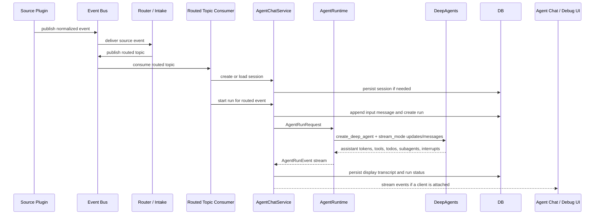
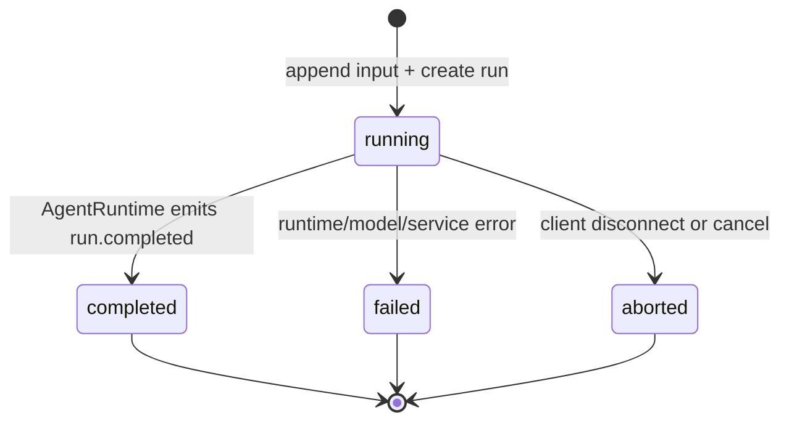
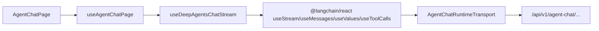

# Agent Chat 与 AgentRuntime 运行链路

本文档说明正式 Agent Chat / AgentRuntime 链路如何运转，重点解释 session、run、DeepAgents thread、workspace、stream、持久化和 debug 入口之间的关系。

本文档不是新的 debug fixture 方案。Debug 页面只能作为开发态快捷入口和参数面板，必须复用正式 session、正式 run、正式 AgentRuntime 和正式 stream 协议。

## 当前状态

| 能力 | 当前实现 | 目标形态 |
| --- | --- | --- |
| 正式 Agent Chat API | 已实现 `POST /api/v1/agent-chat/sessions`、`GET /api/v1/agent-chat/sessions/{session_id}`、`POST /api/v1/agent-chat/sessions/{session_id}/messages/stream` | 保持为 Web、debug、Worker 和 routed topic consumer 的共同入口 |
| session 持久化 | 已实现 `agent_chat_sessions`、`agent_chat_runs`、`agent_chat_messages` | 增加 routed event/session policy metadata 和 artifact 索引 |
| DeepAgents thread | 已使用稳定 `thread_id`，不再用 `agent_run_id` 充当 thread | 后续接入 durable checkpoint/store 时继续沿用同一个 `thread_id` |
| stream | 已通过 AgentRuntime 输出 `messages + updates` 方向的事件，并由 Web adapter 转为 `@langchain/react` 可消费事件 | 增强 tool、artifact、subagent、interrupt 的结构化展示和 raw JSON 面板 |
| routed topic 自动运行 | 尚未落地，当前手动页面创建 session 并发送消息 | Router / Intake 输出 routed topic 后，由 consumer 自动创建或复用 session 并启动 run |
| debug 页面 | 当前只跳转正式 `/agent-chat` | 增加开发态参数面板：事件选择、payload JSON、run policy、tool profile、artifact JSON、raw stream 查看 |

## 端到端流程

### 正常生产链路

正常情况下，用户不会手动打开 Agent Chat 来启动分析。链路应由事件驱动：



生产链路里的关键点是：`Router / Intake` 只决定事件应该交给哪个行业、哪个 Agent、用什么初始上下文和策略，不直接运行行业 MainAgent。真正启动 Agent 的地方是 routed topic consumer，它复用 Agent Chat / AgentRuntime 的同一套 session 和 run 编排。

### 当前 MVP 手动链路

当前 `/agent-chat` 页面仍是手动触发：

1. 页面 mount 后调用 `POST /api/v1/agent-chat/sessions` 创建一个 session。
2. 用户发送消息时调用 `POST /api/v1/agent-chat/sessions/{session_id}/messages/stream`。
3. `AgentChatService` 追加 user message、创建 run，并构造 `AgentRunRequest`。
4. `AgentRuntime` 调用 DeepAgents 并输出 stream。
5. 后端把 stream event 持久化为 display transcript，前端同时流式展示。

这个手动链路是调试和开发入口，不代表生产事件一定由用户主动发消息。

## 核心 ID 边界

| ID | 生成时机 | 稳定周期 | 所属层 | 用途 |
| --- | --- | --- | --- | --- |
| `session_id` | 创建 Agent Chat session 时 | 一个会话 | API / DB / UI | 加载历史聊天、追加消息、归并多次 run |
| `thread_id` | 创建 session 时 | 一个会话 | AgentRuntime / DeepAgents | DeepAgents / LangGraph 的稳定 thread，不暴露给前端 SDK 做默认 hydrate |
| `workspace_id` | 创建 session 时 | 一个会话，后续可细化到 workspace policy | AgentRuntime / artifact | 绑定工作区、临时文件、artifact 和上下文工具 |
| `run_id` | 每次输入启动 run 时 | 一次 API run | API / DB | 产品侧 run 行主键，用于状态、错误和 transcript 关联 |
| `agent_run_id` | 每次输入启动 run 时 | 一次 AgentRuntime run | AgentRuntime | Runtime 内部运行 ID，工具调用、事件、trace 关联 |
| `trace_id` | 每次 run 创建时 | 一次 run | API / Runtime / Log | 日志、stream、错误和审计关联 |
| `event_id` | Router / Intake 或手动 chat 生成 | 一个源事件或手动消息 | Event / Runtime | 表示本次 run 绑定的来源事件；当前手动链路使用 `event_chat_*` |
| `routed_event_id` | Router 产出 routed topic 时 | 一个路由结果 | Event / Consumer | 后续用于幂等、去重、session policy 和 replay |

不能混用这些 ID。尤其是：

- `thread_id` 不是 `agent_run_id`。同一 session 的多次 run 必须复用同一个 DeepAgents `thread_id`。
- `session_id` 是产品会话 ID，不应直接传给 DeepAgents frontend SDK 作为 LangGraph server thread。
- Web 当前使用本地 UI thread id 驱动 `@langchain/react` custom transport，避免 SDK fallback 请求 `localhost:8123/threads/:id/state`。

## Session 管理

### session 是什么

session 是一次可恢复的 Agent Chat 上下文，承载：

- 行业和 Agent 选择：`industry_id`、`agent_id`。
- DeepAgents 稳定线程：`thread_id`。
- workspace / artifact 边界：`workspace_id`。
- 多次 run 的 display transcript。
- 后续 routed topic 的 session policy metadata。

当前数据库表：

```python
class AgentChatSessionORM(Base):
    session_id: str
    thread_id: str
    workspace_id: str
    industry_id: str
    agent_id: str
    title: str | None
    status: str
    metadata_json: dict[str, object]
    created_at: datetime
    updated_at: datetime
```

当前创建 API：

```python
class AgentChatCreateSessionRequest(BaseModel):
    industry_id: str = "quantagent.default.industry.general"
    agent_id: str = "quantagent.default.agent.chat"
    title: str | None = None
```

目标上，routed topic consumer 创建 session 时不应只依赖页面传参，而应从路由结果中解析：

```python
class RoutedAgentSessionInit(BaseModel):
    routed_event_id: str
    source_event_id: str
    industry_id: str
    agent_id: str
    session_policy: Literal["new_per_event", "reuse_by_entity_window", "reuse_existing"]
    session_key: str
    workspace_policy: Literal["session", "event", "entity"]
    title: str | None = None
    metadata: dict[str, object] = Field(default_factory=dict)
```

这不是当前 API 入参，而是 routed topic consumer 和 service 之间后续应补的内部 DTO。它的作用是避免 debug 页面和生产 consumer 分叉。

### 新 session 初始化

创建新 session 时必须完成：

1. 生成 `session_id`、`thread_id`、`workspace_id`。
2. 写入 `industry_id`、`agent_id`、`status="active"`。
3. 写入 metadata。
4. 返回空 display transcript。
5. 不启动 AgentRuntime。

创建 session 本身不代表已经分析事件。只有 routed topic consumer 或用户消息进入 `messages/stream` 时，才会启动 run。

### 老 session 加载

加载老 session 时：

1. 通过 `session_id` 查询 session。
2. 按 `seq` 查询 display transcript。
3. 返回 user、assistant、tool、subagent、todo、artifact、interrupt、final、error 等消息。
4. MVP 调试链路不做 transcript/debug/audit 可见性拆分；后端已持久化的 runtime content 和 payload 都应返回。

当前 response：

```python
class AgentChatSessionResponse(BaseModel):
    session_id: str
    thread_id: str
    workspace_id: str
    industry_id: str
    agent_id: str
    title: str | None
    status: str
    messages: list[AgentChatMessageResponse]
    created_at: datetime
    updated_at: datetime
```

### routed topic 如何决定创建还是复用 session

目标 consumer 应按 session policy 决定：

| 场景 | 推荐策略 | 例子 |
| --- | --- | --- |
| 第一手重大事件 | `new_per_event` 或 `reuse_by_entity_window` | 官方财报、监管公告、突发事故 |
| 同一事件的后续媒体报道 | `reuse_by_entity_window` | 半小时后媒体报道“超预期”，但之前官方财报 run 已经处理 |
| 用户手动继续追问 | `reuse_existing` | 用户在同一 ChatApp 里追问“刚才这个结论依据是什么” |
| debug replay | `reuse_existing` 或 `new_per_event` | 重放默认 NVDA 财报样例 |

去重和复用不应只靠 LLM 判断。consumer 需要用 `routed_event_id`、实体、时间窗口、事件类型、source priority 和已存在 run metadata 先做确定性匹配，再把“是否需要交易动作、是否需要再次通知”等判断交给 MainAgent / Policy Gate。

## Run 管理

### run 是什么

run 是 session 里的单次 AgentRuntime 执行。一个 session 可以有多次 run：

- 第一手财报事件触发一次 run。
- 后续媒体报道触发一次 run，但可能只打分、不交易、不通知。
- 用户手动追问触发一次 run。
- debug replay 触发一次 run。

当前 run 表：

```python
class AgentChatRunORM(Base):
    run_id: str
    session_id: str
    agent_run_id: str
    trace_id: str
    status: str
    started_at: datetime
    completed_at: datetime | None
    error_summary: str | None
    metadata_json: dict[str, object]
```

### run 生命周期



一次 run 启动时，service 必须：

1. 确认 `session_id` 存在。
2. 追加输入 message。
3. 生成 `run_id`、`agent_run_id`、`trace_id`。
4. 写入 `agent_chat_runs(status="running")`。
5. 构造 `AgentRunRequest`。
6. 调用 `AgentRuntime.run_stream()`。
7. 增量持久化 runtime event。
8. 完成后更新 run 状态；失败时写入脱敏 `error_summary`。

当前 stream request：

```python
class AgentChatStreamRequest(BaseModel):
    message: str
```

目标 routed topic consumer 不一定传自然语言 message，而是把路由事件和上下文格式化成 `input_message`，同时把结构化事件快照放入 `RunContextSnapshot` 或 artifact，而不是要求 LLM 自己传大 JSON。

## AgentRunRequest

`AgentRunRequest` 是 API/Worker/consumer 与 AgentRuntime 的核心契约：

```python
class AgentRunRequest(BaseModel):
    session_id: str
    thread_id: str
    workspace_id: str
    agent_run_id: str
    event_id: str
    industry_id: str
    trace_id: str
    agent_definition: AgentDefinition
    run_context: RunContextSnapshot
    tool_profile: ToolProfile
    runtime_policy: RuntimePolicy
    input_message: str
```

职责边界：

- `AgentChatService` / routed topic consumer 负责把产品事件变成 `AgentRunRequest`。
- `AgentRuntime` 负责把 `AgentRunRequest` 变成 DeepAgents 调用。
- 行业包只声明 `AgentDefinition`、prompt、skill、tool profile、subagent，不直接创建 DeepAgents。
- 工具通过 `ToolRuntimeContext` 自动获得运行上下文，不要求模型手写 `session_id`、`thread_id`、`workspace_id`、`agent_run_id`、`event_id` 或本地 path。

工具隐藏上下文：

```python
class ToolRuntimeContext(BaseModel):
    session_id: str
    thread_id: str
    workspace_id: str
    agent_run_id: str
    event_id: str
    industry_id: str
    agent_id: str
    subagent_id: str | None
    trace_id: str
    tool_profile_id: str
```

## DeepAgents 运行方式

AgentRuntime 内部使用 DeepAgents，但平台不把 DeepAgents 细节散落到 API、Web 或行业包里。

运行配置：

```python
config = {
    "configurable": {
        "thread_id": request.thread_id,
        "session_id": request.session_id,
        "workspace_id": request.workspace_id,
        "agent_run_id": request.agent_run_id,
    }
}

input_data = {
    "messages": [{"role": "user", "content": request.input_message}]
}

graph.stream(input_data, config=config, stream_mode=["updates", "messages"])
```

DeepAgents 能力边界：

- planning：使用 DeepAgents 内置 todo 能力，不由平台自研 planner 状态机。
- subagent：由 `AgentDefinition.subagents` 配置，MainAgent 通过 `task` 工具委派。
- tools：由 ToolRegistry / ToolProfile 授权后注入，工具 schema 只暴露业务参数。
- HITL：需要审批的工具通过 `interrupt_on` 和 checkpointer 配置，前端展示 interrupt。
- memory / filesystem：MVP 以 session/workspace 边界为主；长期 memory、durable checkpoint/store 是后续增强，不在当前 DB transcript 里伪造。

## Stream 与 transcript

### Runtime event

AgentRuntime 输出 `AgentRunEvent`：

```python
class AgentRunEvent(BaseModel):
    type: AgentRunEventType
    agent_run_id: str
    trace_id: str
    seq: int
    payload: dict[str, object]
    content: str | None
```

重要事件类型：

| Runtime event | display role/kind | 用途 |
| --- | --- | --- |
| `run.started` | `assistant/system_event` | run 开始 |
| `model.delta` | `assistant/delta` | assistant token 或 message delta |
| `todo.updated` | `assistant/todo` | DeepAgents todo 状态 |
| `tool.started/completed/failed` | `tool/tool` | 工具调用摘要 |
| `subagent.started/completed` | `subagent/subagent` | subagent 状态 |
| `artifact.created` | `assistant/artifact` | artifact 引用或摘要 |
| `interrupt.requested` | `assistant/interrupt` | 人类审批请求 |
| `run.output` | `assistant/final` | 最终输出 |
| `run.failed` | `assistant/error` | 脱敏失败信息 |
| `run.completed` | `assistant/system_event` | run 完成 |

### API stream event

后端 SSE 每帧是 `AgentChatStreamEvent`：

```python
class AgentChatStreamEvent(BaseModel):
    event_id: str
    type: str
    session_id: str
    run_id: str | None
    agent_run_id: str | None
    seq: int | None
    role: str | None
    kind: str
    content: str
    payload: dict[str, Any]
    trace_id: str | None
    created_at: datetime
```

SSE 形态：

```text
event: model.delta
id: msg_xxx
data: {"event_id":"msg_xxx","type":"model.delta",...}
```

API stream 的职责是产品协议，不是 LangGraph deployment server 协议。Web 通过 adapter 把它转换为 `@langchain/react` 可消费的 protocol event。

### display transcript

当前消息表：

```python
class AgentChatMessageORM(Base):
    message_id: str
    session_id: str
    run_id: str | None
    seq: int
    role: str
    kind: str
    content: str
    payload: dict[str, object]
    created_at: datetime
```

transcript 保存 Agent Chat 调试需要恢复的信息：

- 保存：用户消息、assistant delta/final、工具事件、todo、subagent、artifact ref、interrupt、错误内容和 runtime payload。
- 不维护 `visibility: transcript/debug/audit` 三套协议，也不再把 `safe_summary` 作为主字段。
- CoT 只有在 DeepAgents、LangChain 或模型 provider 的返回 payload 中真实存在时才可能展示；系统不要求 Agent 自行生成不可验证的推理链。

后续 artifact 需要单独建 artifact store / artifact index。transcript 中只放 `artifact_id`、类型、摘要、查看权限和必要 JSON 摘要，不把大型产物直接塞进 message。

## 前端数据流

当前正式前端 feature：

```text
features/agent-chat/
  api/         # Agent Chat API、contracts、SSE parser、RuntimeTransport
  queries/     # session 加载 query
  hooks/       # 页面状态和 @langchain/react 编排
  components/  # ChatApp 展示
  types/       # UI display model
  utils/       # reducer / formatter
```

前端运行链路：



关键约束：

- 组件不直接请求 API。
- `AgentChatRuntimeTransport` 是唯一协议桥。
- assistant token 必须合并成同一条 assistant message，不允许每个 token 渲染成一条消息。
- `values.todos`、tool calls、interrupts、subagents 走结构化状态，不混进普通对话气泡。
- 不把后端 `thread_id` 传给 `useStream.threadId`。当前 SDK 在某些情况下会请求默认 LangGraph server，例如 `http://localhost:8123/threads/:id/state`，这会绕过 QuantAgent API。

## Debug 页面应该怎么做

Debug 的定位是“开发态快捷控制台”，不是第二套 Agent 产品。

### Debug 可以做

Debug 页面可以提供这些能力：

| 面板 | 作用 |
| --- | --- |
| Event Selector | 选择或编辑事件，默认使用 `semiconductor.nvda_earnings` 样例 |
| Routed Topic Preview | 展示 Router / Intake 会输出的 routed topic JSON |
| Session Panel | 创建新 session、加载已有 session、查看 `session_id/thread_id/workspace_id` |
| Run Panel | 设置 model preset、industry、agent、tool profile、dry-run、auto-run、trace verbosity |
| Chat Transcript | 复用正式 Agent Chat UI 展示完整 transcript |
| Runtime Events | 展示 `AgentChatStreamEvent` 列表和 raw SSE frames |
| DeepAgents State | 展示 messages、todos、tool calls、subagents、interrupts |
| Artifact Inspector | 按 `artifact_id` 查看 artifact 摘要和 JSON |
| Error / Trace | 查看错误内容、`trace_id`、timing 和 retry 信息 |

默认事件可以是英伟达财报样例，但它只能作为一个可编辑的 event fixture：

```python
class DebugEventDraft(BaseModel):
    fixture_id: str = "semiconductor.nvda_earnings"
    event_payload: dict[str, object]
    routed_override: dict[str, object] = Field(default_factory=dict)
    auto_run: bool = True
```

这个 DTO 只属于 debug 控制面，不应进入 AgentRuntime。debug 页面最终仍应调用正式 session/run 服务，或者调用一个“模拟 routed topic consumer”的开发态 service，而不是恢复旧的 `/debug/agent-runs/fixtures/.../stream` 协议。

### Debug 不应该做

- 不维护独立 Agent debug SSE endpoint。
- 不用 mock/scripted fixture 冒充真实产品 run。
- 不绕过 AgentRuntime 直接调用 DeepAgents。
- 不把交易审批、Policy Gate 或 broker 权限做成前端可绕过开关。

## routed topic consumer 目标契约

后续自动消费 routed topic 时，建议形成一个内部 service 入口：

```python
class RoutedAgentRunCommand(BaseModel):
    routed_event_id: str
    source_event_id: str
    industry_id: str
    agent_id: str
    session_policy: str
    session_key: str
    event_summary: str
    event_payload_ref: str | None = None
    event_payload_snapshot: dict[str, object] = Field(default_factory=dict)
    run_policy: dict[str, object] = Field(default_factory=dict)
    tool_profile_id: str | None = None
```

consumer 执行步骤：

1. 用 `routed_event_id` 做幂等检查，避免重复启动 run。
2. 用 `session_policy/session_key` 查找或创建 session。
3. 把事件摘要追加为输入 message，或生成面向 MainAgent 的 `input_message`。
4. 把大 payload 存为 artifact / context ref，只在 `RunContextSnapshot` 放摘要和引用。
5. 创建 run，构造 `AgentRunRequest`。
6. 消费 `AgentRuntime.run_stream()`，持久化 transcript、artifact、状态和错误。
7. 根据 final output、ActionPlan、Policy Gate 和 Notification policy 决定是否通知用户或请求审批。

这条链路和 Web 手动发送消息应共享同一个 `AgentChatService` 或同一套下沉后的 orchestration service，避免生产和 debug 分叉。

## 英伟达财报调试样例应该如何落到系统

目标调试场景：

1. Debug 页面默认选中 `semiconductor.nvda_earnings`。
2. 页面展示可编辑 event JSON，例如来源、发布时间、公司、标题、原文摘要、数字字段、source priority。
3. 开发者点击运行。
4. Debug 控制面模拟 Router 输出 routed topic：`industry_id=semiconductor`、`agent_id=semiconductor.main`、`session_policy=reuse_by_entity_window`。
5. consumer 创建或复用 session。
6. run 绑定第一手财报事件，MainAgent 可调用搜索工具补市场预期和上下文。
7. 如果判断超预期且满足自动审批策略，后续 ActionPlan / Policy Gate / broker dry-run 或 mock 执行会产生行动 artifact 和通知。
8. 半小时后媒体报道再次进入 routed topic，consumer 根据实体和时间窗口复用 session；MainAgent 看到已有财报 run 和通知记录，可以决定只评分、不交易、不重复通知。

在 UI 上应能看到：

- 第一手财报 run 的 transcript、tool search 摘要、todo、final、ActionPlan artifact。
- 后续媒体报道 run 的 transcript、去重判断和“无需重复通知/无需交易”的原因。
- 每次 run 的 `run_id/agent_run_id/trace_id`。
- artifact JSON，而不是只看自然语言 summary。

## 失败与恢复边界

| 失败 | 当前处理 | 后续增强 |
| --- | --- | --- |
| session 不存在 | 返回 404，不创建 run | 无 |
| 模型配置缺失 | stream 输出脱敏失败，run 标记 failed | 在 debug 面板显示模型配置入口和 trace |
| provider 调用失败 | `run.failed` + error transcript | 增加 provider retry/fallback policy |
| 客户端断开 | run 可标记 aborted，已落库 transcript 可加载 | 后台继续运行和 reconnect 需要 durable checkpoint |
| DeepAgents interrupt | 作为 interrupt event 展示 | 接入审批 UI 和 resume |
| 重复 routed event | 尚未实现 | 用 `routed_event_id` 幂等表和 session policy 防重复 |
| API 重启 | DB transcript 可恢复，进行中的 run 不恢复 | 后续接入 LangGraph checkpoint/store |

MVP 的真源是数据库里的 session、run 和 display transcript。实时 stream 只是传输方式，不是状态真源。

## 实现收敛点

后续继续优化时，优先按这个顺序收敛：

1. 把 routed topic consumer 和手动 Agent Chat 共用同一个 session/run orchestration。
2. 给 session metadata 增加 `source`、`session_key`、`routed_event_id`、`entity_keys`、`time_window` 等字段。
3. 给 run metadata 增加 `input_kind`、`routed_event_id`、`tool_profile_id`、`runtime_policy`、`model_ref`、timing。
4. 把 artifact store 从 transcript 中拆出来，只在 message payload 放 `artifact_id` 和摘要。
5. Debug 页面补事件选择、routed topic preview、raw stream、artifact JSON 和 replay。
6. Durable checkpoint/store 成熟后，再支持 API 重启后的 interrupt resume 和长期 memory。
